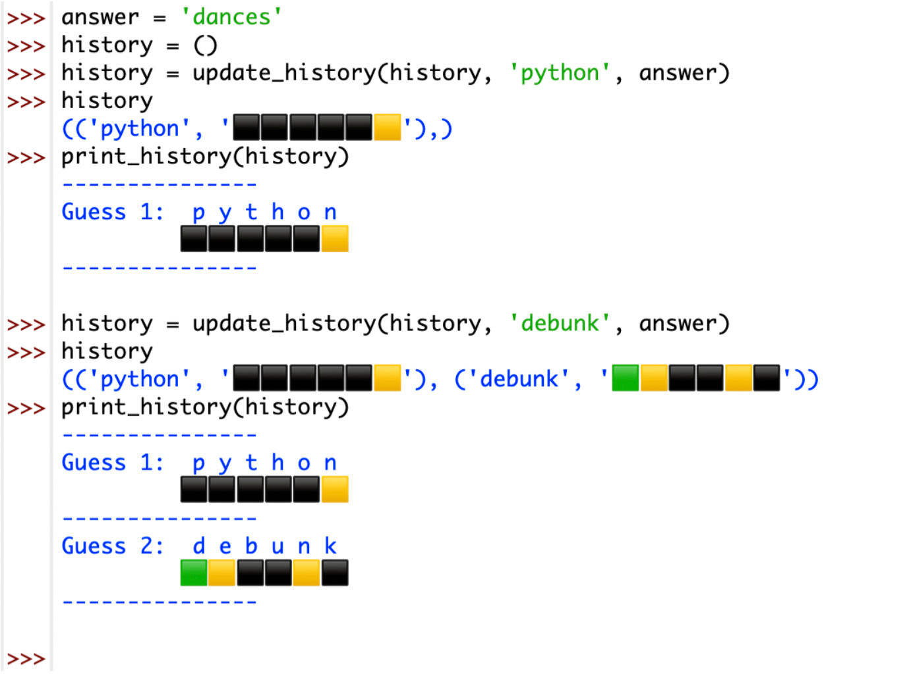

## 5.5 process guess(guess: str, answer: str) -> str

Returns a modified representation of guess, in which each letter is replaced by:

-   A green square if that letter occurs in the same position in answer.
    -   如果该字母在答案中出现在同一**位置**，则为**绿色**方块。✅

-   A yellow square if that letter occurs in a different position in answer.
    -   如果该字母在答案中出现在不同的位置，则为黄色方块。✅

-   A black square if that letter does not occur in answer.
    -   如果该字母没有出现在答案中，则为黑色方块。✅

While answers must contain 6 unique letters, guesses may contain duplicate letters. 

虽然 answer 必须包含 6 个**独特**的字母，但 guess 可能包含重复的字母。**「answer 单词不重复」**

If duplicate letters exist in the guess, only one can have a non-black square. 

如果 guess 中存在重复的字母，只有一个字母可以有非黑色的方块（黄色或者绿色）。

If the letter does exist in answer, the non-black square is allocated as follows:

如果该字母在 answer 中存在，那么非黑色方块的分配方式如下。

1. If one of the occurrences is in the correct position, it receives a green square and all other occurrences receive a black square.

如果其中一个出现在正确的位置上，它就会得到一个绿色的方块，其他的出现都会得到一个黑色的方块。✅

2. Otherwise, if no occurrences are in the correct position, the first occurrence of the letter in guess receives a yellow square and all other occurrences receive a black square.

  否则，如果没有出现在正确的位置上，guess 中的字母的第一次出现会得到一个黄色的方块，所有其他的出现会得到一个黑色的方块。

  the second 'r' gets non-black square because it is in the right position

  第二个 'r' 得到非黑色方块，因为它在正确的位置上。「第二个 ‘r'  得到绿色方块，因为在正确的位置 」

  ```python
  process_guess('arrows', 'strand')
  🟨⬛🟩⬛⬛🟨
  ```

  the first 'r' gets the non-black square because no r's are in the right postition but r exist in the answer. 

​    

  第一个’r‘ 得到黄色方块，因为没有’r' 在正确的位置，但r存在于answer中

  ```python
  process_guess('arrows', 'answer')
  🟩🟨⬛⬛🟨🟨
  ```

```python
green = "🟩"
yellow = "🟨"
black = "⬛"


def process_guess(guess, answer):
	# print(CORRECT + MISPLACED + INCORRECT)
	template = ""
	BASE = (0, 1, 2, 3, 4, 5)
	if len(guess) == 6 and len(answer) == 6:
		guess_lst = list(zip(list(guess), BASE))  # 这是得到每个元素的下标
		answer_lst = list(zip(list(answer), BASE))
		# print(guess_lst)
		# print(answer_lst)
		for g_w, g_p in guess_lst:
			if g_w not in answer:
				template += black
			else:
				i = 0
				for a_w, a_p in answer_lst:
					# if guess.count(g_w) >= 2 and i == 0 and g_p == a_p:
					# 	# template += MISPLACED  # 黄色
					# 	template += green  # 绿色
					# 	i += 1
					# elif guess.count(g_w) >= 2 and i == 1 and g_p != a_p:
					# 	template += black  # 黑色
					# 	i += 1
					# elif guess.count(g_w) >= 2 and g_p == a_p:
					# 	template += CORRECT  # 绿色
					if g_w == a_w and g_p == a_p:  # 字母相同。位置相同
						template += green  # 绿色
					elif g_w == a_w and g_p != a_p:
						template += yellow  # 黄色
					elif guess.count(g_w) > 1:
						if g_w in answer:
							if g_w == a_w and g_p == a_p:
								"""如果其中一个出现在正确的位置上，它就会得到一个绿色的方块"""
								template += green
								i += 1
								# if g_p != a_p:
								# 	template += black
							elif g_w == a_w and g_p != a_p:
								if i == 0:
									template += yellow
									i += 1
								elif i >= 1:
									"""其他的出现都会得到一个黑色的方块。"""
									template += black
							# elif g_w == a_w and g_p == a_p and i == 0:
							# 	template += black
							# else:
							# 	template += black
		# print(template)
		return (guess, template)
	else:
		return None

# 1. guess 的字母跟 answer 的相同并且位置相同，那就显示成绿色方块
# 2. 如果字母相同位置不同，显示成黄色方块，都不是显示黑色方块，
# 如果 guess 里面有两个跟 answer 其中一个字母相同，只能有一个是黄色方块，另一个是黑色方块
if __name__ == '__main__':
	process_guess("debunk", "dances")
	process_guess("candle", "dances")
	process_guess("arrows", "strand")
	process_guess("arrows", "answer")
```


## 5.6 update history( history: tuple[tuple[str, str], ...], guess: str, answer: str ) -> tuple[tuple[str, str], ...]

返回历史记录的副本，包括最新的 guess 和它的处理形式 (process_guess)。

Returns a copy of history updated to include the latest guess and its processed form. 

参见第 5.7 节，了解该函数的使用实例。

history 是一个**元组**，其中每个元素都是一个（guess，process_guess）的元组。

See Section 5.7 for example usage of this function. history is a tuple where each element is a tuple of (guess, processed_guess). 

Prints the guess history in a user-friendly way.



```python
from lesson04 import process_guess


def update_history(history, guess, answer):
	his = process_guess(guess, answer)
	# print(his)
	history += (his, )
	return history

def print_history(history):
	index = 1
	for guess, over in history:
		g_lst = list(guess)
		o_lst = list(over)
		d = dict(zip(g_lst, o_lst))
		print(d)
		template = f"""
---------------
Guess {index}:{g_lst[0]}{g_lst[1]}{g_lst[2]}{g_lst[3]}{g_lst[4]}{g_lst[5]}
{over[0]}{over[1]}{over[2]}{over[3]}{over[4]}{over[5]}
---------------
		"""
		index += 1
		print(template)


answer = "dances"
history = ()

history = update_history(history, 'Python', answer)
print(history)

history = update_history(history, 'debunk', answer)
print(history)

print_history(history)
```


## 5.8 print keyboard(history: tuple[tuple[str, str], ...]) -> None

5.8 以用户友好的方式打印键盘上当前已知的每个字母的信息。

5.8 Prints the keyboard in a user-friendly way with the information currently known about each letter.

这两列是以制表符分隔的。Note that the two columns are tab-separated.stats是一个包含7个元素的元组，分别是1-6个猜测中赢得的回合数。和输掉的回合数，分别是。stats is a tuple containing seven elements, which are the number of rounds won in 1-6 guesses, and the number of rounds lost, respectively. 
这个函数以一种用户友好的方式打印出统计数字。This function prints the stats in a user-friendly way.


提示：

```python
history = (('Python', '⬛⬛⬛⬛⬛🟨'), ('debunk', '🟩🟨⬛⬛🟨⬛'))


s = "A、B、C、D、E、F、G、H、I、J、K、L、M、N、O、P、Q、R、S、T、U、V、W、X、Y、Z"
new_s = s.lower().replace("、", "")
even_word = new_s[::2]
odd_word = new_s[1::2]
print(odd_word)
# template = "{}:{}\t\t{}:{}\n"
# template = "{}:{}\t\t{}:{}\n"*13
lst = zip(even_word, odd_word)
# print(template)
f_k = ""
for e, o in lst:
	template = f"{e}:{f_k}\t\t{o}:{f_k}\n"
	print(template, end="")
# s = """
# a:
# """
# a:		b:
# c:		d:
# e:		f:
# g:		h:
# i:		j:
# k:		l:
# m:		n:
# o:		p:
# q:		r:
# s:		t:
# u:		v:
# w:		x:
# y:		z:
```


