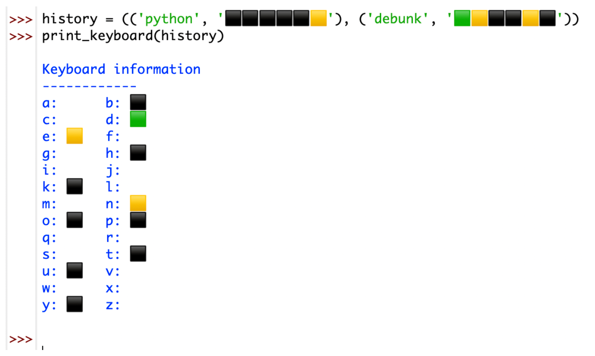
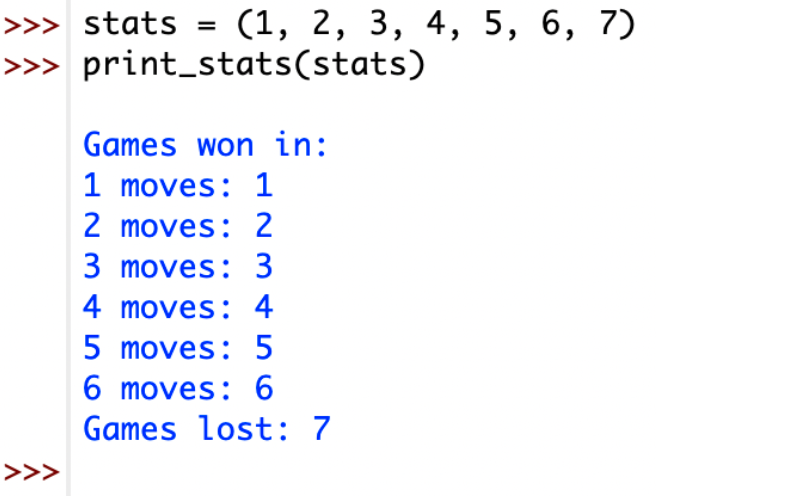

## 5.8 print keyboard(history: tuple[tuple[str, str], ...]) -> None

5.8 以用户友好的方式打印键盘上当前已知的每个字母的信息。

5.8 Prints the keyboard in a user-friendly way with the information currently known about each letter.

这两列是以制表符分隔的。Note that the two columns are tab-separated.stats是一个包含7个元素的元组，分别是1-6个猜测中赢得的回合数。和输掉的回合数，分别是。stats is a tuple containing seven elements, which are the number of rounds won in 1-6 guesses, and the number of rounds lost, respectively. 
这个函数以一种用户友好的方式打印出统计数字。This function prints the stats in a user-friendly way.



提示：

```python
history = (('Python', '⬛⬛⬛⬛⬛🟨'), ('debunk', '🟩🟨⬛⬛🟨⬛'))


s = "A、B、C、D、E、F、G、H、I、J、K、L、M、N、O、P、Q、R、S、T、U、V、W、X、Y、Z"
new_s = s.lower().replace("、", "")
even_word = new_s[::2]
odd_word = new_s[1::2]
print(odd_word)
# template = "{}:{}\t\t{}:{}\n"
# template = "{}:{}\t\t{}:{}\n"*13
lst = zip(even_word, odd_word)
# print(template)
f_k = ""
for e, o in lst:
	template = f"{e}:{f_k}\t\t{o}:{f_k}\n"
	print(template, end="")
# s = """
# a:
# """
# a:		b:
# c:		d:
# e:		f:
# g:		h:
# i:		j:
# k:		l:
# m:		n:
# o:		p:
# q:		r:
# s:		t:
# u:		v:
# w:		x:
# y:		z:
```

```python
def print_key_board(history):
	s = "A、B、C、D、E、F、G、H、I、J、K、L、M、N、O、P、Q、R、S、T、U、V、W、X、Y、Z"
	new_s = s.lower().replace("、", "")
	# even_word = new_s[::2]
	# odd_word = new_s[1::2]
	# print(odd_word)
	template_d = dict(zip(new_s, ["" for _ in range(26)]))
	# print(d)
	template_s = """
	Keyboard information
	------------
	a:A\tb:B
	c:C\td:D
	e:E\tf:F
	g:G\th:H
	i:I\tj:J
	k:K\tl:L
	m:M\tn:N
	o:O\tp:P
	q:Q\tr:R
	s:S\tt:T
	u:U\tv:V
	w:W\tx:X
	y:Y\tz:Z
	"""
	lst = []
	for h in history:
		p_0 = list(h[0])
		p_1 = list(h[1])
		data_dict = dict(zip(p_0, p_1))
		# print(data_dict)
		lst.append(data_dict)
	for l in lst:
		for key, value in l.items():
			# print(f"{key}:{value}")
			template_d[key] = value
	print(template_d)
	for key, value in template_d.items():
		template_s = template_s.replace(key.upper(), value)
	print(template_s)


history = (('Python', '⬛⬛⬛⬛⬛🟨'), ('debunk', '🟩🟨⬛⬛🟨⬛'))
print_key_board(history)
```


## 5.9 print stats(stats: tuple[int, ...]) -> None

stats is a tuple containing seven elements, which are the number of rounds won in 1-6 guesses,

and the number of rounds lost, respectively. 

stats 是一个包含 7 个元素的元组，分别是 1-6 个猜测中赢得的回合数。和输掉的回合数，分别是。

This function prints the stats in a user-friendly way.




