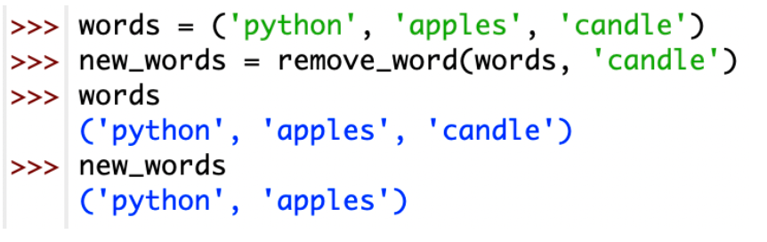
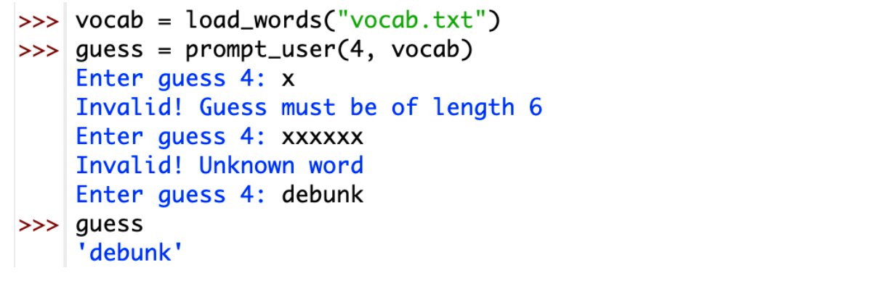
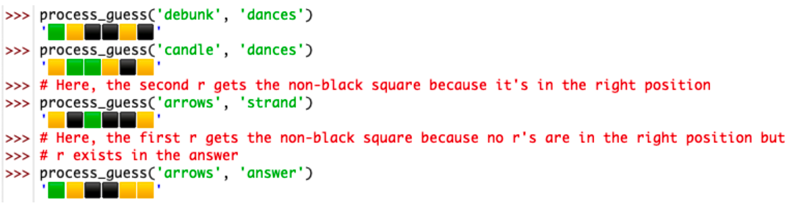

你好，我是悦创。

# 5.3 `remove word(words: tuple[str, ...], word: str) -> tuple[str, ...]`
Returns a copy of words with word removed, assuming that words contains word exactly once.


```python
# 作业基本要求
def remove_word(t_words, word) -> tuple:
    lst = list(t_words)
#     i = lst.index(word)
    lst.remove(word)
    return tuple(lst)
```
```python
words = ("Python", "apples", "candle")
new_words = remove_word(words, "candle")
print(words)
print(new_words)
```
扩展：
```python
def remove_word(t_words, word) -> tuple:
    if word in t_words:
        lst = list(t_words)
        lst.remove(word)
        return tuple(lst)
    else:
        return t_words
```
```python
words = ("Python", "apples", "candle")
new_words = remove_word(words, "aiyc")
print(words)
print(new_words)
```

# 5.4 `prompt user(guess number: int, words: tuple[str, ...]) -> str`
Prompts the user for the next guess, reprompting until either a valid guess is entered, or a selection for help, keyboard, or quit is made. Returns the first valid guess or request for help, keyboard, or quit. Note that the processing of the guess once it has been entered does not need to be handled in this function; it will be handled in functions defined later in this section. The returned string must be lowercase.

这个意思就是从 `vocab.txt` 的范围猜词，然后必须是猜的词必须是六个字母，如果填了不在 `vocab.txt` 里的词就会识别不出来。

## 5.4.1 Example usage


```python
def load_words(filename: str) -> tuple[str,...]:
	""" Loads all words from the file with the given name.

	Parameters:
		filename (str): The name of the file to load from. Each word must be on
						a separate line.

	Returns:
		tuple<str>: A tuple containing all the words in the file.
	"""
	with open(filename, 'r') as file:
		words = [line.strip() for line in file.readlines()]
	return tuple(words)

def prompt_user(number, content):
	i = 1
	while i <= number:
		guess_text = input("Enter guess " + str(number) + ":")
		# print(i) # 判断 while 循环次数
		if len(guess_text) < 6:
			print("Invalid! Guess must be of length 6")
		elif guess_text in content:
			break
		else:
			print("Invalid! Unknown word")
		i += 1
	return guess_text


vocab = load_words("data/vocab.txt")
# print(vocab)
guess = prompt_user(4, vocab)
print(guess)
```

```python
def load_words(filename: str) -> tuple[str,...]:
	""" Loads all words from the file with the given name.

	Parameters:
		filename (str): The name of the file to load from. Each word must be on
						a separate line.

	Returns:
		tuple<str>: A tuple containing all the words in the file.
	"""
	with open(filename, 'r') as file:
		words = [line.strip() for line in file.readlines()]
	return tuple(words)

def prompt_user(number, content):
	i = 1
	while i <= number:
		guess_text = input("Enter guess " + str(number) + ":")
		# print(i) # 判断 while 循环次数
		if len(guess_text) < 6:
			print("Invalid! Guess must be of length 6")
		elif guess_text not in content:
			print("Invalid! Unknown word")
		else:
			break
		i += 1
	return guess_text


vocab = load_words("data/vocab.txt")
# print(vocab)
guess = prompt_user(4, vocab)
print(guess)
```

# 5.5 `process guess(guess: str, answer: str) -> str`
Returns a modified representation of guess, in which each letter is replaced by:

- A green square if that letter occurs in the same position in answer;
- A yellow square if that letter occurs in a different position in answer; or
- A black square if that letter does not occur in answer.

While answers must contain 6 unique letters, guesses may contain duplicate letters. If duplicate letters exist in the guess, only one can have a non-black square. If the letter doesn’t exist in the answer, all occurrences of said letter in guess are given black squares. If the letter does exist in answer, the non-black square is allocated as follows:

1. If one of the occurrences is in the correct position, it receives a green square and all other occurrences receive a black square.

2. Otherwise, if no occurrences are in the correct position, the first occurrence of the letter in guess receives a yellow square and all other occurrences receive a black square.

Precondition: `len(guess) == 6 and len(answer) == 6`
See a1 support.py for constants containing the required square characters.

意思是如果 guess 的字母跟 answer 的相同并且位置相同，那就显示成绿色方块，如果字母相同位置不同，显示成黄色方块，都不是显示黑色方块，如果 guess 里面有两个跟 answer 其中一个字母相同，只能有一个是黄色方块，另一个是黑色方块。

## 5.5.1 Example usage


如果 guess 里面有两个字母跟 answer 里面其中一个相同，guess 中有一个正好是在相同位置， 另一个的字母被排除掉变成黑色方块。

```python
CORRECT = "🟩"
MISPLACED = "🟨"
INCORRECT = "⬛"


def process_guess(guess, answer):
	# print(CORRECT + MISPLACED + INCORRECT)
	template = ""
	BASE = (0, 1, 2, 3, 4, 5)
	if len(guess) == 6 and len(answer) == 6:
		guess_lst = list(zip(list(guess), BASE))  # 这是得到每个元素的下标
		answer_lst = list(zip(list(answer), BASE))
		# print(guess_lst)
		# print(answer_lst)
		for g_w, g_p in guess_lst:
			if g_w not in answer:
				template += INCORRECT
			else:
				i = 0
				for a_w, a_p in answer_lst:
					# if guess.count(g_w) >= 2 and i != 1 and i <= 1:
					# if guess.count(g_w) >= 2 and i == 0:
					if guess.count(g_w) >= 2 and i == 0 and g_p == a_p:
						# template += MISPLACED  # 黄色
						template += CORRECT  # 绿色
						i += 1
					elif guess.count(g_w) >= 2 and i == 1 and g_p != a_p:
						template += INCORRECT  # 黑色
						i += 1
					# elif guess.count(g_w) >= 2 and g_p == a_p:
					# 	template += CORRECT  # 绿色
					elif g_w == a_w and g_p == a_p:  # 字母相同。位置相同
						template += CORRECT  # 绿色
					elif g_w == a_w and g_p != a_p:
						template += MISPLACED  # 黄色
		print(template)
	else:
		return None


# 1. guess 的字母跟 answer 的相同并且位置相同，那就显示成绿色方块
# 2. 如果字母相同位置不同，显示成黄色方块，都不是显示黑色方块，
# 如果 guess 里面有两个跟 answer 其中一个字母相同，只能有一个是黄色方块，另一个是黑色方块
process_guess("debunk", "dances")
process_guess("candle", "dances")
process_guess("arrows", "strand")
process_guess("arrows", "answer")
```

> C++信息奥赛题解，长期更新！长期招收一对一中小学信息奥赛集训，莆田地区有机会线下上门，其他地区线上。微信：Jiabcdefh

> AI悦创·推出辅导班啦，包括「Python 语言辅导班、C++辅导班、算法/数据结构辅导班、少儿编程、pygame 游戏开发」，全部都是一对一教学：一对一辅导 + 一对一答疑 + 布置作业 + 项目实践等。QQ、微信在线，随时响应！V：Jiabcdefh